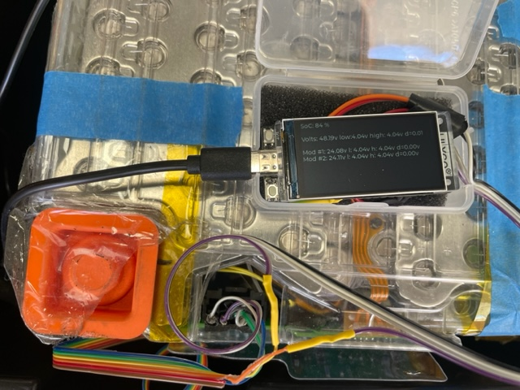
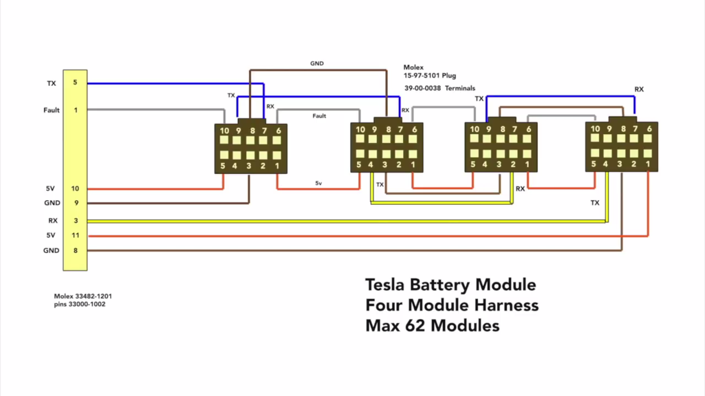

# Tesla BMS for ESP32-S3



Battery Management System interface for Tesla Model S/X battery modules (2012-2020). Runs on either the **LilyGO T-Display-S3** or the **Waveshare ESP32-S3-LCD-1.3-B**, with optional WiFi + MQTT publishing to **Home Assistant** (auto-discovery).

## ⚠️ SAFETY WARNING

**HIGH VOLTAGE - RISK OF ELECTRIC SHOCK AND FIRE**

Tesla battery modules operate at potentially lethal voltages (up to 24V per module, higher in series configurations). Improper handling can result in:
- **Electric shock** causing serious injury or death
- **Fire or explosion** from short circuits
- **Chemical burns** from damaged cells
- **Property damage** from thermal runaway

**REQUIRED SAFETY PRECAUTIONS:**
- ✓ Only work on de-energized systems when possible
- ✓ Use insulated tools and wear appropriate PPE
- ✓ Never work alone on high-voltage systems
- ✓ Ensure proper ventilation when charging/discharging
- ✓ Have fire suppression equipment readily available
- ✓ Understand lithium-ion battery safety before proceeding
- ✓ Verify all connections before applying power
- ✓ Monitor for smoke, unusual odors, or excessive heat
- ✓ Follow local electrical codes and regulations

**By using this software, you accept full responsibility for your safety and any damages that may occur.**

---

## Features

- ✓ Real-time voltage monitoring per cell and module
- ✓ Temperature monitoring (2 sensors per module)
- ✓ State of Charge (SoC) calculation and display
- ✓ Automatic cell balancing with configurable thresholds
- ✓ Fault detection and alerting
- ✓ Color LCD display with rotating pages:
  - Time display (when WiFi enabled)
  - BMS status and metrics
  - Debug information (chip stats, battery voltage, network status line)
- ✓ USB serial console for debugging and diagnostics
- ✓ Support for up to 62 modules in series/parallel configurations
- ✓ Watchdog timer protection against system hangs
- ✓ CRC-validated communication with BMS modules
- ✓ **WiFi + MQTT publishing** with Home Assistant auto-discovery (multi-pack safe)
- ✓ **Two supported boards**: LilyGO T-Display-S3 and Waveshare ESP32-S3-LCD-1.3-B

---

## Hardware Requirements

### ESP32 Development Board

Two boards are supported. Pick one PlatformIO env when building (see below).

**Option A — LilyGO T-Display-S3** *(env: `lilygo-t-display-s3`)*
- ESP32-S3 with integrated 1.9" LCD (170×320 ST7789V, parallel i80 bus)
- [GitHub - T-Display-S3](https://github.com/Xinyuan-LilyGO/T-Display-S3)
- USB-C with native CDC; usually flashes out of the box on macOS/Linux/Windows.

**Option B — Waveshare ESP32-S3-LCD-1.3-B** *(env: `esp32-s3-lcd-1_3-b`)*
- ESP32-S3 with integrated 1.3" SPI LCD (240×280 ST7789)
- [Waveshare product page](https://www.waveshare.com/wiki/ESP32-S3-LCD-1.3)
- Uses a WCH CH343 USB-serial bridge — **macOS users must install the WCH CH34x driver** before flashing or upload will fail at the stub-upload stage. See `PLATFORMIO_SETUP.md` for the troubleshooting walkthrough.

### Tesla Battery Modules
- **Compatible Models:** Tesla Model S/X (2012-2020)
- **Voltage Range:** ~18-25.2V per module (6S configuration)
- **BMS Controller:** TI bq76PL536A (included in module)
- **Communication:** Custom serial protocol at 612,500 baud

### Connectors and Cables
You'll need Molex connectors to interface with the Tesla modules:

- **Housing:** [Molex 15-97-5101](https://www.mouser.com/ProductDetail/Molex/15-97-5101) (5-position housing)
- **Pins:** [Molex 39-00-0038](https://www.mouser.com/ProductDetail/Molex/39-00-0038-Cut-Strip) (crimp pins)
- **Quantity:** 1 connector per module
- **Wire:** Recommend 22-24 AWG for signal lines

**Alternative:** Pre-made Tesla BMS cables available from various EV parts suppliers.

---

## Pinout and Wiring

### Tesla Module to ESP32-S3 Connection



**Molex Connector Pinout** (viewing from top of connector):

| Molex Pin | Signal | ESP32-S3 GPIO | Wire Color (typical) | Notes |
|-----------|--------|---------------|----------------------|-------|
| 1         | N/C    | -             | -                    | Not connected |
| 2         | RX     | GPIO01 (TX)   | White/Green          | ESP TX → Module RX |
| 3         | GND    | GND           | Black                | Common ground |
| 4         | TX     | GPIO02 (RX)   | White/Orange         | Module TX → ESP RX |
| 5         | +5V    | 5V            | Red                  | Power supply |

**Additional ESP32 Connections:**

| Function        | ESP32 GPIO | Notes |
|-----------------|------------|-------|
| Fault Detection | GPIO11     | Pulled LOW when any module reports fault |
| Battery Voltage | GPIO04     | ADC input with 2:1 voltage divider |
| LCD Backlight   | GPIO38     | PWM controlled (internal) |
| Power Enable    | GPIO15     | Must be HIGH to keep board powered |

### Complete Pinout Reference
See [ESP32-S3 T-Display pinout diagram](images/esp32-pinout.jpg) for full GPIO mapping.

### Wiring Multiple Modules

**Series Configuration:**
- Daisy-chain the communication lines (TX/RX) between modules
- Each module automatically assigns itself a unique address
- Connect ESP32 to the first module in the chain
- Maximum: 62 modules in series

**Parallel Configuration:**
- Wire all modules in parallel to the ESP32
- Adjust `BMS_NUM_PARALLEL` in configuration
- Ensure adequate current capacity in wiring

---

## Software Installation

You can build this project using either **PlatformIO** (recommended) or **Arduino IDE**.

### Method 1: PlatformIO (Recommended)

PlatformIO provides better dependency management, faster builds, and easier project configuration.

#### Prerequisites

1. **Install PlatformIO**
   - **VS Code:** Install PlatformIO IDE extension from Extensions marketplace
   - **CLI:** Install via pip: `pip install platformio`
   - Documentation: [https://platformio.org/install](https://platformio.org/install)

#### Installation Steps

1. **Clone the Repository**
   ```bash
   git clone https://github.com/yourusername/tesla-bms-esp32s3.git
   cd tesla-bms-esp32s3
   ```

2. **Open in PlatformIO**
   - **VS Code:** File → Open Folder → Select project directory
   - **CLI:** Navigate to project directory

3. **Configure Your BMS Setup**
   - Edit `include/bms_config.h` to match your battery configuration
   - (Optional) Set up WiFi + MQTT credentials in `include/secrets.h` — see *WiFi & MQTT* below
   - Save changes

4. **Build the Project — pick your board's env**
   ```bash
   pio run -e lilygo-t-display-s3      # LilyGO T-Display-S3
   pio run -e esp32-s3-lcd-1_3-b       # Waveshare ESP32-S3-LCD-1.3-B
   ```
   Or click "Build" in PlatformIO toolbar (VS Code).

5. **Upload to Board**
   ```bash
   pio run -e <env-name> --target upload
   ```

6. **Monitor Serial Output**
   ```bash
   pio device monitor
   ```

#### PlatformIO Configuration

The project ships two envs in `platformio.ini`. Both share the same source tree; only board, partition table, and a few build flags differ. Library deps (`lvgl`, `PubSubClient`, `ArduinoJson`) are managed automatically.

```ini
[env:lilygo-t-display-s3]
board = lilygo-t-display-s3
build_flags = ... -DTESLA_BMS_TARGET_LILYGO_T_DISPLAY_S3 -DUSE_MQTT=1

[env:esp32-s3-lcd-1_3-b]
board = esp32-s3-lcd-1_3-b
build_flags = ... -DTESLA_BMS_TARGET_ESP32_S3_LCD_1_3_B -DUSE_MQTT=1
board_build.partitions = huge_app.csv
```

`USE_MQTT=1` only **links** the WiFi/MQTT code; networking actually runs only when `WIFI_SSID` is set in `secrets.h`. If you want to strip WiFi/MQTT from the binary entirely, set `-DUSE_MQTT=0` for your env.

---

### Method 2: Arduino IDE

#### Prerequisites

1. **Arduino IDE** (v2.0 or later)
   - Download: [https://www.arduino.cc/en/software](https://www.arduino.cc/en/software)

2. **ESP32 Board Support**
   - Follow installation: [T-Display-S3 Quick Start](https://github.com/Xinyuan-LilyGO/T-Display-S3#quick-start)
   - Board Manager URL: `https://raw.githubusercontent.com/espressif/arduino-esp32/gh-pages/package_esp32_index.json`
   - Install "esp32" by Espressif Systems

3. **Required Libraries** (install via Library Manager)
   - **LVGL** (v8.x) - Graphics library for LCD display
   - Install path: Tools → Manage Libraries → Search "lvgl"

#### Installation Steps

1. **Clone or Download Repository**
   ```bash
   git clone https://github.com/yourusername/tesla-bms-esp32s3.git
   cd tesla-bms-esp32s3
   ```

2. **Open Project in Arduino IDE**
   - File → Open → Select `tesla-bms-esp32s3.ino`
   - All project files should load automatically

3. **Configure Board Settings**
   - Tools → Board → esp32 → **LilyGO T-Display-S3**
   - Tools → Port → Select your COM port
   - Tools → Upload Speed → **115200** (stable) or 921600 (faster)

4. **Configure Your BMS Setup**
   - Open `bms_config.h` in Arduino IDE
   - Modify configuration (see Configuration section below)
   - Save changes

5. **Compile and Upload**
   - Click "Upload" button (→) or Ctrl+U
   - Wait for compilation and upload to complete
   - Monitor serial output at 115200 baud

---

## Configuration

### Essential Settings (bms_config.h)

#### Battery Configuration

```cpp
// Number of modules in series (voltage adds up)
#define BMS_NUM_SERIES       2

// Number of parallel strings (capacity adds up)
#define BMS_NUM_PARALLEL     1
```

**Examples:**
- **48V System:** 2 modules in series (`BMS_NUM_SERIES = 2`)
- **96V System:** 4 modules in series (`BMS_NUM_SERIES = 4`)
- **Parallel Pack:** 2 series × 3 parallel = 6 modules total

#### Balancing Settings

```cpp
// Minimum voltage to enable balancing (volts per cell)
#define BMS_BALANCE_VOLTAGE_MIN    4.0

// Voltage difference to trigger balancing (volts)
#define BMS_BALANCE_VOLTAGE_DELTA  0.04
```

**Recommendations:**
- Start with conservative values (4.0V min, 0.04V delta)
- Only balance during charging above 80% SoC
- Monitor temperatures during first balance cycle

#### Advanced Settings (EEPROMSettings struct)

These settings are defined in the `settings` structure but **not currently loaded from EEPROM** (future feature):

```cpp
settings.OverVSetpoint = 4.2;      // Over-voltage fault threshold (V/cell)
settings.UnderVSetpoint = 2.8;     // Under-voltage fault threshold (V/cell)
settings.OverTSetpoint = 65.0;     // Over-temperature fault (°C)
settings.UnderTSetpoint = -20.0;   // Under-temperature fault (°C)
settings.IgnoreTemp = 0;           // Ignore temp sensors (0=use, 1=ignore)
settings.IgnoreVolt = 0.5;         // Ignore cells below this voltage
settings.balanceVoltage = 4.1;     // Target balance voltage
settings.balanceHyst = 0.04;       // Balance hysteresis
```

**Note:** Currently these must be set in code. `IgnoreVolt` accepts values from 0.0 V up to 4.3 V. EEPROM persistence is planned for future release.

### WiFi & MQTT Configuration (`include/secrets.h`)

All network credentials live in **one git-ignored file**: `include/secrets.h`. To start, copy the template:

```bash
cp include/secrets.example.h include/secrets.h
```

Then edit `include/secrets.h`:

```cpp
#define WIFI_SSID      "your-ssid"
#define WIFI_PASSWORD  "your-password"

#define MQTT_HOST      "192.168.1.10"   // your Home Assistant / Mosquitto broker
#define MQTT_PORT      1883
#define MQTT_USER      "tesla_bms"
#define MQTT_PASSWORD  "broker-password"

// Friendly name shown in Home Assistant. Multiple packs auto-derive a unique
// id from the ESP32's MAC address, so you can flash the same secrets.h to
// several boards or rename per-pack (e.g. "Tesla BMS Garage").
#define MQTT_NODE_NAME "Tesla BMS"
```

**Three modes, controlled by which fields you fill in:**

| Want | `WIFI_SSID` | `MQTT_HOST` | Result |
|------|-------------|-------------|--------|
| BMS only, no networking | empty | (any) | WiFi/MQTT skipped at boot |
| WiFi only (e.g. NTP) | set | empty | WiFi connects, no MQTT |
| Full HA integration | set | set | Auto-discovery + live telemetry |

The auto-disable check happens at runtime, so the same firmware binary covers all three modes — no rebuild needed when toggling.

### Home Assistant Integration

When `WIFI_SSID` and `MQTT_HOST` are both set, the firmware publishes telemetry via MQTT with [Home Assistant Discovery](https://www.home-assistant.io/integrations/mqtt/#mqtt-discovery), so entities appear automatically in HA — no YAML required.

**HA-side setup (one-time):**
1. Install the **Mosquitto broker** add-on (Settings → Add-ons → Add-on Store).
2. Install the **MQTT** integration (Settings → Devices & Services → Add Integration → MQTT). Use the Mosquitto add-on credentials, or create a dedicated HA user for the ESP32.
3. Flash the firmware with matching credentials in `secrets.h`. Within ~10 s of boot, a device named after `MQTT_NODE_NAME` appears under Settings → Devices & Services → MQTT.

**Entities published per pack:**
- Pack: voltage, SoC, low cell, high cell, cell delta, low/high temperature
- Binary: fault, balancing
- Per detected module: voltage, cell delta, temperature
- Availability via MQTT LWT — HA marks the device offline within ~30 s if power is yanked

**Multiple packs on the same network:**
The MQTT node id is auto-suffixed with the last 4 hex chars of the ESP32's MAC address (e.g. `tesla_bms_garage_a4c1`), so flashing the same `secrets.h` to several boards just works — each appears as a distinct HA device. Set `MQTT_NODE_NAME` differently per board if you want friendly names ("Tesla BMS Garage", "Tesla BMS Shed").

**Topic layout** (for custom clients):
- `<node_id>/availability` — `online` / `offline` (retained, LWT)
- `<node_id>/pack/state` — JSON: `v`, `low`, `high`, `delta`, `soc`, `t_low`, `t_high`, `fault`, `balancing`, `modules_online`
- `<node_id>/module/<n>/state` — JSON: `v`, `low`, `high`, `delta`, `t_low`, `t_high`, `valid`, `balance_mask`
- Discovery configs published once on connect under `homeassistant/{sensor,binary_sensor}/<node_id>/...`

A more elaborate dashboard — including HACS cards (`bar-card`, `auto-entities`, `mini-graph-card`) that scale automatically to any module count, plus example automations for cell drift / fault / offline alerts — is sketched in `tasks/todo.md` (Phase 6).

### Debug Configuration (bms_config.h)

```cpp
// Serial console for debugging (Serial object)
#define SERIALCONSOLE   Serial

// BMS communication serial port
extern HardwareSerial SERIALBMS;  // Defined in .ino file as HardwareSerial(0)
```

Change log level in `setup()`:
```cpp
Logger::setLoglevel(Logger::Debug);  // Options: Debug, Info, Warn, Error, Off
```

---

## Operation

### First Power-On

1. **Connect ESP32 to computer via USB-C**
2. **Open Serial Monitor** (115200 baud)
3. **Observe startup sequence:**
   ```
   LCD initialization...
   BMS initialization...
   Scanning for modules...
   Found X modules
   ```
4. **Check LCD display** - should show voltage and SoC

### Normal Operation

**Display Pages** (auto-rotate every 5 seconds):
1. **Time Display** (WiFi only) - Current time from NTP
2. **BMS Status** - Voltage, SoC, cell info, balancing status
3. **Debug Info** - Chip stats, battery voltage, network status line (e.g. `net: wifi -65dBm | mqtt ok`)

**LED Indicators:**
- Built-in LED behavior depends on firmware state
- Check serial console for detailed status

### Serial Console Commands

Connect via USB serial at 115200 baud to access debug console.

**Available commands** (single letter):
- Type commands and press Enter
- See `SerialConsole.cpp` for full command list

### Balancing Operation

**Automatic Balancing:**
- Activates when `High Cell V > BMS_BALANCE_VOLTAGE_MIN`
- AND `High Cell V > (Low Cell V + BMS_BALANCE_VOLTAGE_DELTA)`
- Runs for 5-minute cycles with 5-minute pauses
- Status shown on display: "*** BALANCING ***"

**During Balancing:**
- Modules may warm slightly (normal)
- Monitor temperatures via serial console
- Stop if any module exceeds 45°C

### Fault Handling

**Fault Detection:**
- GPIO11 pulled LOW when any module reports fault
- Fault status displayed on screen
- Error logged to serial console

**Common Faults:**
- Over/under voltage
- Over/under temperature
- Communication errors
- Module not responding

**Recovery:**
1. Check serial console for specific fault details
2. Verify all connections are secure
3. Check voltage and temperature readings
4. Power cycle if necessary
5. If persistent, check individual modules

---

## Troubleshooting

### Compilation Errors

**Error: "config.h: No such file or directory"**
- Ensure all project files are in the same directory
- `config.h` should exist (created automatically in recent versions)
- Try re-cloning the repository

**Error: "LVGL library not found"**
- Install LVGL via Library Manager: Tools → Manage Libraries → Search "lvgl"
- Install version 8.x (not 9.x)

**Error: "Board not found"**
- Install ESP32 board support via Board Manager
- Restart Arduino IDE after installation

### Upload Errors

**Error: "Failed to connect to ESP32"**
- Hold BOOT button while clicking Upload
- Try different USB cable (some are charge-only)
- Check COM port selection in Tools → Port
- Install/update USB drivers for CH340 or CP2102

**Error: "Sketch too big"**
- Select correct board (T-Display-S3, not generic ESP32)
- Increase partition size: Tools → Partition Scheme → "Huge APP"

### Runtime Errors

**Display shows "ERROR: Failed to allocate LVGL display buffer!"**
- Not enough memory for display
- This should not happen on ESP32-S3 with correct board selection
- Verify board selection and try re-uploading

**No modules found**
- Check wiring: TX/RX are crossed (ESP TX → Module RX)
- Verify 5V power supply is adequate (500mA per module minimum)
- Check for loose Molex connections
- Try connecting to just one module first
- Verify baud rate is 612500 (set automatically in code)

**Incorrect voltage readings**
- Verify module voltage with multimeter
- Check voltage conversion constants in `constants.h`:
  - `VOLTAGE_CONVERSION_MODULE = 0.002034609f`
  - `VOLTAGE_CONVERSION_CELL = 0.000381493f`
- May need calibration based on your modules

**Watchdog resets (constant rebooting)**
- Indicates system hang or timeout
- Check for infinite loops or blocking code
- Increase `WATCHDOG_TIMEOUT_SEC` in `constants.h` if needed
- Review serial output for error messages before reset

**Balancing not working**
- Check voltage thresholds in `bms_config.h`
- Ensure cells are above `BMS_BALANCE_VOLTAGE_MIN`
- Verify delta is sufficient: High - Low > `BMS_BALANCE_VOLTAGE_DELTA`
- Check serial console for balancing messages

**Temperature reading -100°C or 200°C**
- Indicates disconnected or faulty temperature sensor
- Check module thermistor connections
- Set `IgnoreTemp = 1` if sensors not used (future feature)

### Communication Issues

**Garbled data / CRC errors**
- Verify RX/TX wiring (must be crossed)
- Check ground connection is solid
- Reduce wire length if possible (max 3 meters recommended)
- Add 120Ω termination resistor at end of daisy-chain
- Shield cables if in electrically noisy environment

**Random disconnects**
- Check power supply stability (use quality 5V supply, 2A minimum)
- Add decoupling capacitors near ESP32 (100µF + 0.1µF)
- Verify all modules have solid power and ground

---

## Technical Details

### Communication Protocol

**Serial Configuration:**
- Baud rate: 612,500 (non-standard, Tesla specific)
- Format: 8N1 (8 data bits, no parity, 1 stop bit)
- CRC: Custom 8-bit CRC for data validation
- Addressing: Module IDs 1-62 (0x01-0x3E)

**Message Format:**
```
[Address+R/W][Command][Length][Data...][CRC]
```

**Key Registers:**
- `0x01` - Device status
- `0x03-0x0D` - Cell voltages (6 cells)
- `0x0F-0x11` - Temperature sensors (2 per module)
- `0x20-0x23` - Fault and alert status
- `0x32` - Balance control
- `0x3B` - Address control

### Voltage Calculations

**Module Voltage:**
```cpp
moduleVolt = (rawValue * 256 + rawValue) * 0.002034609f;  // Volts
```

**Cell Voltage:**
```cpp
cellVolt = (rawValue * 256 + rawValue) * 0.000381493f;  // Volts per cell
```

**State of Charge (SoC):**
```cpp
avgCellVolt = packVolt / BMS_NUM_SERIES;
SoC = ((avgCellVolt - 18.0) / (25.2 - 18.0)) * 100;  // Percentage
```

### Temperature Calculations

Uses Steinhart-Hart equation for NTC thermistors:
```cpp
R = ADC_to_resistance(rawValue);
T_kelvin = 1.0 / (A + B*ln(R) + C*pow(ln(R), 3));
T_celsius = T_kelvin - 273.15;
```

Where:
- A = 0.0007610373573
- B = 0.0002728524832
- C = 0.0000001022822735

### Memory Usage

**Typical:**
- Flash: ~800KB / 16MB (5%)
- RAM: ~120KB / 512KB (23%)
- PSRAM: Available if needed (8MB)

### Watchdog Timer

- Timeout: 10 seconds
- Reset locations: Main loop, startup delay
- Prevents system lockup and automatic recovery

---

## Development

### Project Structure

```
tesla-bms-esp32s3/
├── platformio.ini              # PlatformIO configuration
├── tesla-bms-esp32s3.ino       # Arduino IDE sketch (legacy)
├── src/                        # Source files (PlatformIO)
│   ├── main.cpp                # Main application
│   ├── BMSModule.cpp           # Individual module interface
│   ├── BMSModuleManager.cpp    # Pack-level management
│   ├── Logger.cpp              # Logging system
│   ├── SerialConsole.cpp       # Debug console
│   ├── factory_gui.cpp         # LCD GUI interface
│   ├── WifiManager.cpp         # WiFi lifecycle (non-blocking, backoff)
│   ├── MqttPublisher.cpp       # MQTT + Home Assistant discovery
│   └── font_Alibaba.c          # Display font data
├── include/                    # Header files (PlatformIO)
│   ├── config.h                # Global configuration loader
│   ├── bms_config.h            # BMS settings and constants
│   ├── pin_config.h            # Hardware pin definitions (per-board)
│   ├── constants.h             # Named constants (magic numbers, MQTT timing)
│   ├── BMSModule.h             # Module interface header
│   ├── BMSModuleManager.h      # Manager header
│   ├── BMSUtil.h               # Low-level communication
│   ├── Logger.h                # Logging header
│   ├── SerialConsole.h         # Console header
│   ├── factory_gui.h           # GUI header
│   ├── WifiManager.h           # WiFi lifecycle header
│   ├── MqttPublisher.h         # MQTT publisher header
│   ├── secrets.example.h       # Template (committed)
│   └── secrets.h               # Local creds (gitignored)
├── lib/                        # Custom libraries (if any)
└── images/                     # Documentation images
```

**Note:** The project supports both PlatformIO (using `src/` and `include/`) and Arduino IDE (using root `.ino` and `.cpp/.h` files).

### Code Architecture

**Key Classes:**
- `BMSModule` - Represents single Tesla module (voltages, temps, faults)
- `BMSModuleManager` - Manages array of modules, balancing, aggregation
- `BMSUtil` - Static utility class for serial communication with CRC
- `Logger` - Multi-level logging (Debug/Info/Warn/Error)
- `SerialConsole` - Interactive USB serial command interface

**Major Functions:**
- `setup()` - Initialize hardware, LCD, BMS, and watchdog
- `loop()` - Main processing loop (500ms BMS update cycle)
- `balanceCells()` - Activate cell balancing on high modules
- `collectTelemetry()` - Read module telemetry and refresh cached pack data
- `ui_*()` - LVGL display update functions

### Adding Features

1. **Fork the repository**
2. **Create feature branch:** `git checkout -b feature/my-feature`
3. **Make changes** following existing code style
4. **Test thoroughly** with real hardware
5. **Submit pull request** with detailed description

### Code Style

- Use existing naming conventions
- Add comments for complex logic
- Update `constants.h` for any magic numbers
- Use header guards in all `.h` files
- Test with hardware before committing

---

## Testing Recommendations

### Before Deployment

1. **Bench Test**
   - Test with 1 module first, verify readings with multimeter
   - Gradually add modules to test scaling
   - Verify balancing activates correctly

2. **Load Test**
   - Run for 24+ hours continuously
   - Monitor for watchdog resets
   - Check for memory leaks (should be stable)

3. **Fault Testing**
   - Disconnect a module, verify fault detection
   - Check over/under voltage handling (carefully!)
   - Test temperature sensor failures

4. **Communication Test**
   - Test maximum cable length for your installation
   - Verify CRC error rate is low (<0.1%)
   - Test with electrically noisy environment

### Safety Testing

- Verify fault pin (GPIO11) pulls LOW on module fault
- Test emergency shutdown procedures
- Verify voltage readings match multimeter (±0.1V)
- Check temperature readings are reasonable (±5°C)

---

## Known Issues and Limitations

### Current Limitations

1. **EEPROM settings not loaded** - Configuration is compile-time only (credentials in `secrets.h` are flashed in)
2. **No CAN bus support** - Commented out code exists but not functional
3. **Single-threaded** - All operations in main loop (no FreeRTOS tasks)
4. **No on-device data logging** - No SD card. Long-term history lives in HA via MQTT.
5. **Fixed SoC calculation** - Linear interpolation, not accurate across full range
6. **No current sensing** - Voltage-only BMS

### Known Bugs

- None currently (critical bugs fixed in 2025 refactor)
- Report issues at: [GitHub Issues](https://github.com/yourusername/tesla-bms-esp32s3/issues)

### Future Improvements

- [ ] Add web interface for configuration (currently `secrets.h` only)
- [ ] Persist runtime-tunable settings in NVS (`Preferences`)
- [ ] Improve SoC calculation with Coulomb counting
- [ ] Add shunt-based current measurement
- [ ] Refactor BMSModuleManager (too many responsibilities)
- [ ] Add FreeRTOS tasks for better performance
- [ ] Optional MQTT-over-TLS for remote brokers

---

## Credits and License

### Original Work
This project is based on the excellent work by **Collin Kidder (collin80)**:
- Original Repository: [TeslaBMS](https://github.com/collin80/TeslaBMS)
- License: MIT (maintained in this fork)

### This Fork (ESP32-S3 Port)
- ESP32-S3 port and display integration
- Critical bug fixes and code quality improvements
- Enhanced documentation and safety features
- Maintained by: [Your Name/Username]

### Additional Contributors
- ESP32 board support: [Espressif Systems](https://github.com/espressif/arduino-esp32)
- T-Display-S3 hardware: [LilyGO](https://github.com/Xinyuan-LilyGO/T-Display-S3)
- LVGL graphics library: [LVGL Team](https://lvgl.io/)

### Critical Bug Fixes (2025)
Major refactoring and bug fixes by Claude (Anthropic) via Claude Code:
- Fixed safety-critical voltage reporting bug
- Fixed multiple crash-causing errors
- Added watchdog timer management
- Improved code maintainability
- See commit history for detailed changelog

### License

MIT License - See LICENSE file for full text.

**Summary:** You are free to use, modify, and distribute this software for commercial or non-commercial purposes. Attribution is appreciated but not required.

**Disclaimer:** This software is provided "as is" without warranty. Use at your own risk. The authors are not liable for any damages, injuries, or losses resulting from use of this software.

---

## Support and Contributing

### Getting Help

1. **Check this README** - Most common questions answered here
2. **Search Issues** - Someone may have had the same problem
3. **Ask in Discussions** - Community support forum
4. **Open an Issue** - For bugs or feature requests

### Contributing

Contributions welcome! Please:
- Follow existing code style
- Test with real hardware
- Update documentation
- Add clear commit messages

### Reporting Issues

When reporting bugs, please include:
- Arduino IDE or PlatformIO version
- ESP32 board support version
- Complete error message
- Hardware configuration (number of modules, wiring)
- Serial console output
- Steps to reproduce

---

## Acknowledgments

Thank you to:
- Collin Kidder for the original TeslaBMS codebase
- The EV DIY community for sharing knowledge
- LilyGO for affordable ESP32 dev boards
- Everyone who contributes to this project

---

## Disclaimer

**This project is for educational and experimental purposes.**

- Not intended for critical safety applications without thorough testing
- Use of Tesla battery modules may void warranties
- Lithium-ion batteries require proper safety protocols
- Check local regulations regarding battery systems
- Author(s) not responsible for any damage, injury, or loss

**USE AT YOUR OWN RISK**
